<h1 align="center">Better Teams</h1>

<p align="center">
  <strong>Microsoft Teams, finally at home on your Mac.</strong>
</p>

<p align="center">
  
  
  
  <a href="LICENSE"></a>
</p>

<p align="center">
  <picture>
    <source media="(prefers-color-scheme: dark)" srcset="docs/screenshots/chat-dark.png">
    <source media="(prefers-color-scheme: light)" srcset="docs/screenshots/chat-light.png">
    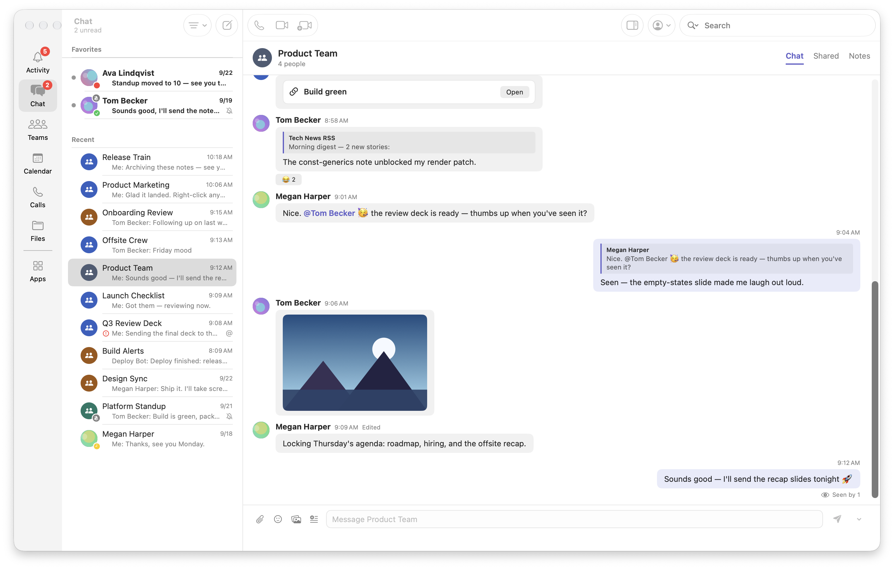
  </picture>
</p>

<p align="center">
  A truly native Teams client, written in AppKit and SwiftUI over a Rust core. No Electron, no browser tab in disguise.<br>
  Chats open instantly, meetings get a real window, your team's apps run right inside it, and Catch Up summaries never leave your Mac.
</p>

<p align="center">
  <a href="#ten-reasons-to-switch"><b>Highlights</b></a> ·
  <a href="#everything-it-does"><b>All features</b></a> ·
  <a href="#get-started"><b>Get started</b></a> ·
  <a href="#license"><b>License</b></a>
</p>

<br>

## Ten reasons to switch

<table>
  <tr>
    <td colspan="2" align="center">
      <br>
      <sub>01</sub>
      <h2>Catch Up, privately on your Mac</h2>
      <p>Back from a week off? One click turns a long thread into a summary, key points and action items, right beside the chat.<br>
      It runs on Apple Intelligence, on this Mac. Your messages are never sent anywhere to be summarized.</p>
      <table>
        <tr>
          <td align="center" width="33%"><b>Off</b><br><sub>No button, no summaries.</sub></td>
          <td align="center" width="33%"><b>When you click</b><br><sub>Summarize the chat you're in, on demand.</sub></td>
          <td align="center" width="33%"><b>Always up to date</b><br><sub>A live Catch Up window that refreshes as messages arrive.</sub></td>
        </tr>
      </table>
      <sub>Pick the last day, three days, five days or two weeks. Background updates pause in Low Power Mode and while your Mac is running hot.</sub>
      <br><br>
      <table>
        <tr>
          <td width="70%" valign="top">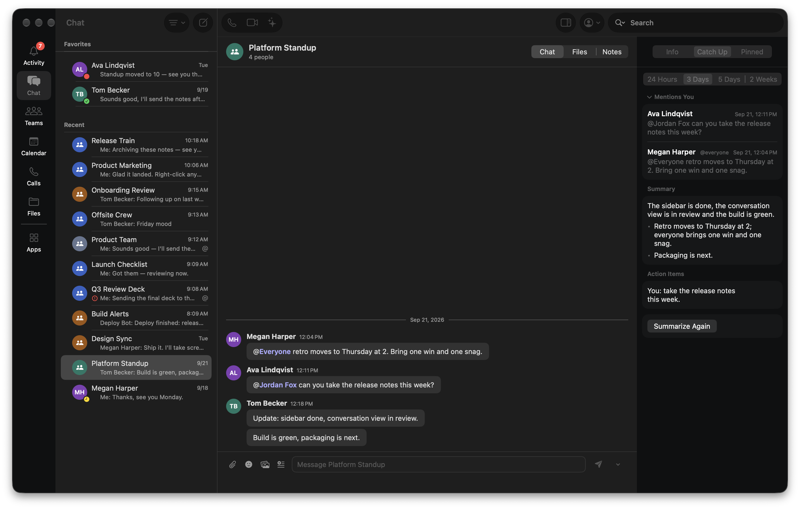</td>
          <td width="30%" valign="top">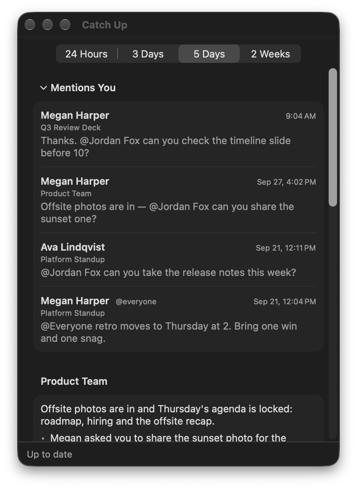</td>
        </tr>
      </table>
      <br>
    </td>
  </tr>
  <tr>
    <td width="58%">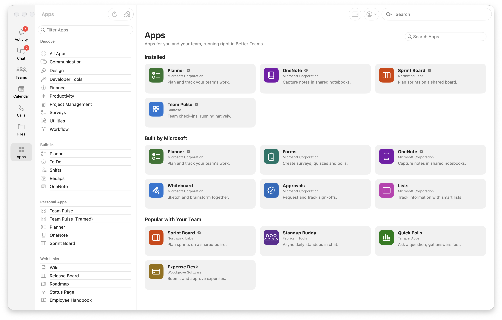</td>
    <td width="42%">
      <sub>02</sub>
      <h3>Teams apps, running natively</h3>
      <p>Most Teams apps run right in the window, hosted by Better Teams itself. Never the Teams web app, and never a browser tab.</p>
      <p>Pin the ones you use and they sit in the sidebar with their real icons. A few apps still ask for a one-time sign-in, and some don't load yet.</p>
    </td>
  </tr>
  <tr>
    <td width="42%">
      <sub>03</sub>
      <h3>Mentions of you, never buried</h3>
      <p>Mentions, replies, reactions and missed calls land in one Activity feed. Click one and you're on the exact message, highlighted.</p>
      <p>With Catch Up on, anything that names you, <code>@everyone</code>, <code>@channel</code>, <code>@team</code> or one of your tags goes to the top. The mention itself decides that, not an AI guess.</p>
    </td>
    <td width="58%">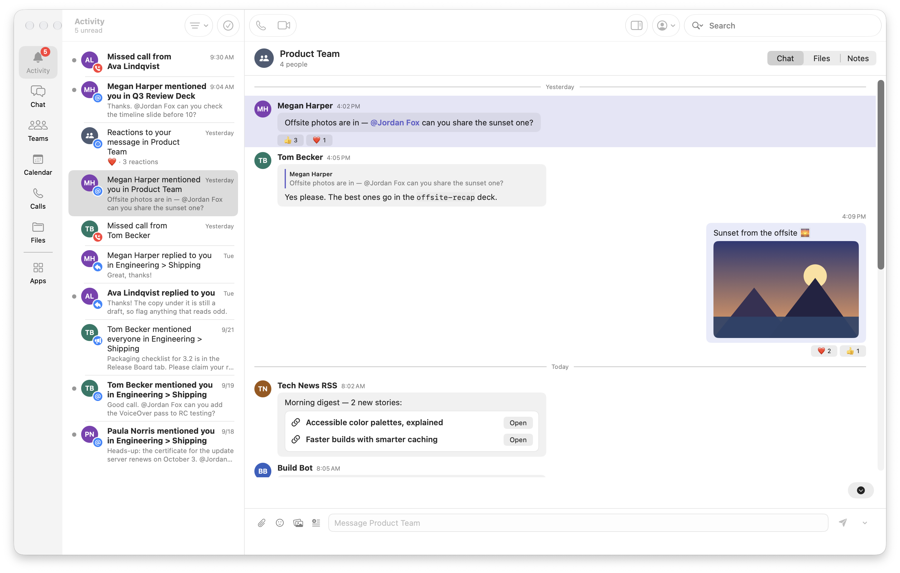</td>
  </tr>
  <tr>
    <td width="58%">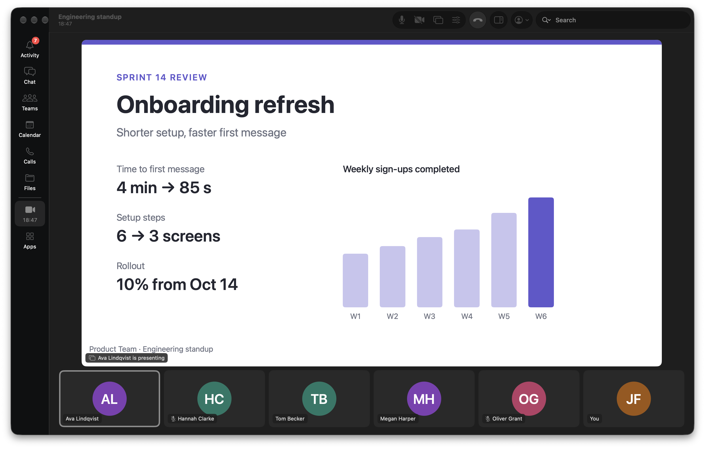</td>
    <td width="42%">
      <sub>04</sub>
      <h3>Meetings in a real Mac window</h3>
      <p>Check your camera and mic in the pre-join preview, then run the call in its own window or inside the main one.</p>
      <p>Video is decoded and encoded in hardware on the Mac's own media engine, for your camera, screen sharing and everyone else's video.</p>
    </td>
  </tr>
  <tr>
    <td width="42%">
      <sub>05</sub>
      <h3>Channels, the way Teams does them</h3>
      <p>General comes first, the channel menu follows Teams' own order, and threads open beside the channel so you can keep reading while you reply.</p>
      <p>Pop a busy channel into its own window, or file channels into sections of your own.</p>
    </td>
    <td width="58%">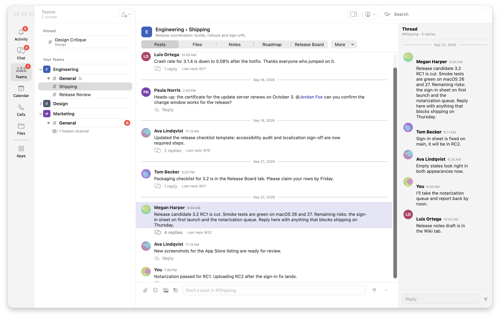</td>
  </tr>
  <tr>
    <td width="58%">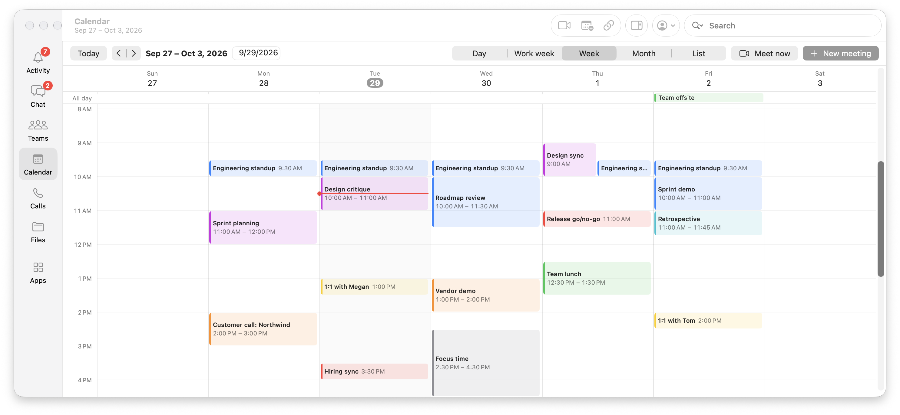</td>
    <td width="42%">
      <sub>06</sub>
      <h3>A calendar that knows what time it is</h3>
      <p>Day, work week, week, month and list views, with meetings always in your time zone, even when you travel.</p>
      <p>Reply to invites, start a Meet now, and the Join button appears as a meeting gets close.</p>
    </td>
  </tr>
  <tr>
    <td width="42%">
      <sub>07</sub>
      <h3>Files that feel like Finder</h3>
      <p>OneDrive, files shared with you and channel files in a real, sortable table. Press Space for Quick Look, drop files in to upload.</p>
      <p>Word, Excel and PowerPoint files open for reading right in the window, with no download.</p>
    </td>
    <td width="58%">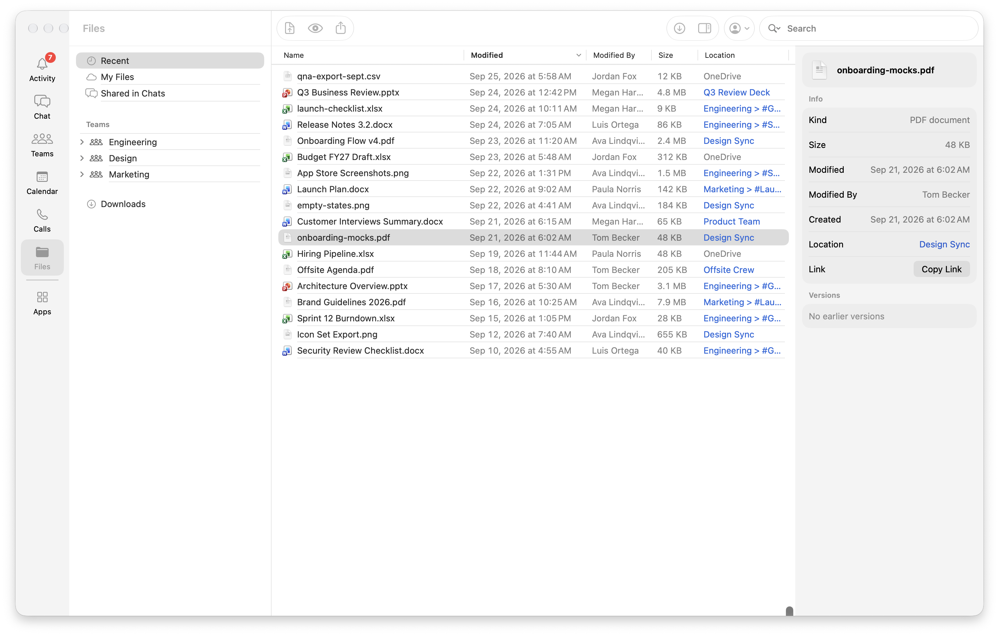</td>
  </tr>
</table>

<table>
  <tr>
    <td width="33%" valign="top">
      <sub>08</sub>
      <h3>Everyone, one hover away</h3>
      <p>Rest on a name to see their photo, title, presence and local time, with a quick message box. Open the full card to chat, call or start a video call from right there.</p>
    </td>
    <td width="33%" valign="top">
      <sub>09</sub>
      <h3>Chats that keep up</h3>
      <p>Your chat list and recent messages are kept on your Mac, so a chat paints the moment you open it. Replies appear as they're sent, and a message that fails to send says so, with Retry.</p>
    </td>
    <td width="33%" valign="top">
      <sub>10</sub>
      <h3>Keyboard first</h3>
      <p>Every command is in the menu bar. <kbd>⌘</kbd><kbd>K</kbd> goes anywhere, <kbd>⌘</kbd><kbd>1</kbd>–<kbd>6</kbd> switch sections, and an optional global hotkey opens a quick composer.</p>
    </td>
  </tr>
</table>

<br>

## Everything it does

### Chat

- Pinned, favorite and recent chats, with Teams folders and filters you can clear in one click
- Unread chats in bold, muted chats marked, and read state that stays in step with Teams
- Right-click a chat to mark it unread, pin, mute, snooze, move it to a folder, hide or leave it
- Chat, Shared and Notes tabs, a Recap tab on meeting chats, and pinned app tabs; the tab row always fits, with extra tabs in an overflow menu
- Chats open instantly from a copy kept on your Mac; older messages load as you scroll up
- New replies appear in the open chat as they arrive; a failed message shows Retry on its own bubble
- Hover a message for six quick reactions, more reactions, Reply and the full message menu
- Reply with quotes, react, edit, delete, forward, save and pin messages
- Send Later with a queue of scheduled messages, plus reusable templates
- Attach files or drop them onto a conversation; GIF search with your own key
- Typing indicators, "Seen by", and a Jump to Latest button with a count
- Images open in a viewer at their final size, in light or dark
- Translate messages into your language
- Ghost mode: hold back read receipts, presence and typing

### People

- Hover cards with photo, title, department, presence, local time and working hours
- Email and phone links, and a quick message box right on the card
- Full contact card with Overview, Organization and Profile tabs
- Chat, audio call or video call from any card
- Presence that updates live

<details>
<summary>See a contact card</summary>
<br>
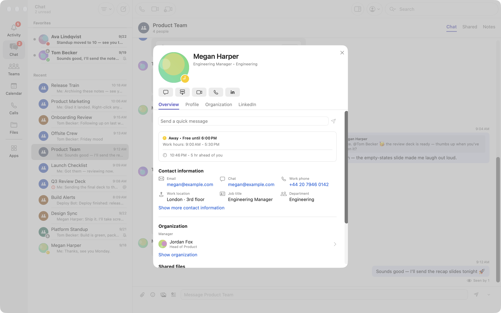
</details>

### Teams and channels

- Join or create teams; create channels
- General listed first, and the channel menu in the same order as Teams
- Edit and Delete follow each team's member permissions
- Open a channel in its own window, or move channels into sections
- Hide teams you don't need; changes made elsewhere show up quickly
- Posts, Files, Notes and app tabs for every channel
- Threads open beside the channel in the inspector
- Team roster with Add Member and Remove

### Meetings and calls

- Join meetings from the calendar or a pasted Teams link, right in the app
- Pre-join preview with camera, mic and device choice
- Hardware-accelerated video decoding and encoding for calls and screen sharing, with a software fallback
- One-to-one audio and video calls, speed dial, recents and missed calls
- Calls ring with a notification you can accept or decline
- Test call to check your setup
- Recap tab on meeting chats with the recording and its transcript

### Calendar

- Day, work week, week, month and list views, with your choice remembered
- Events always shown in your Mac's time zone, following it when it changes; the organizer's zone when it differs
- Event details with time, location and recurring series; accept, tentative or decline
- Meet now, New meeting, and join from the event
- Join, copy the join link, or cancel from the event detail

### Files

- OneDrive, shared with you, channel files and downloads in one place
- Sort, multi-select, move, copy, rename and delete
- Quick Look with Space, drag-and-drop upload, upload progress
- Word, Excel and PowerPoint files open read-only in the window instead of downloading
- File details and version history in the inspector

### Apps

- App store with categories and search; add apps and open them from the library
- Most Teams apps run natively in the window, never the Teams web app; some need a one-time sign-in, and a few don't load yet
- Pin apps to the sidebar, where they show their real icons
- App library with filters, plus your own web links
- Teams links inside apps open in Better Teams, never a browser

### Planner, To Do, Shifts and OneNote

- **Planner:** buckets, checkboxes, add tasks, assignees in the inspector
- **To Do:** your lists, quick add, show or hide completed
- **Shifts:** the week's schedule with a team picker
- **OneNote:** browse notebooks natively and append to a page

<details>
<summary>See Planner</summary>
<br>
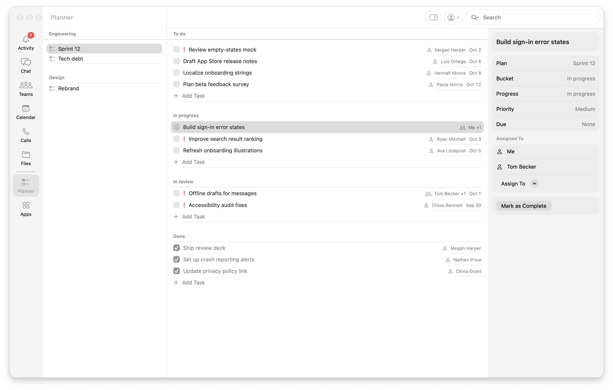
</details>

<details>
<summary>See OneNote</summary>
<br>
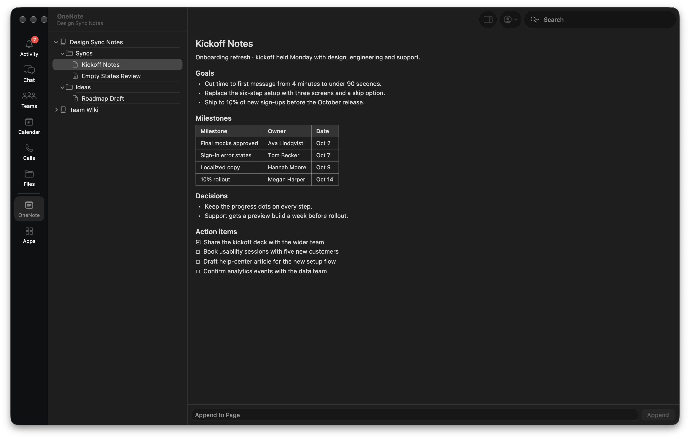
</details>

<details>
<summary>See Shifts</summary>
<br>
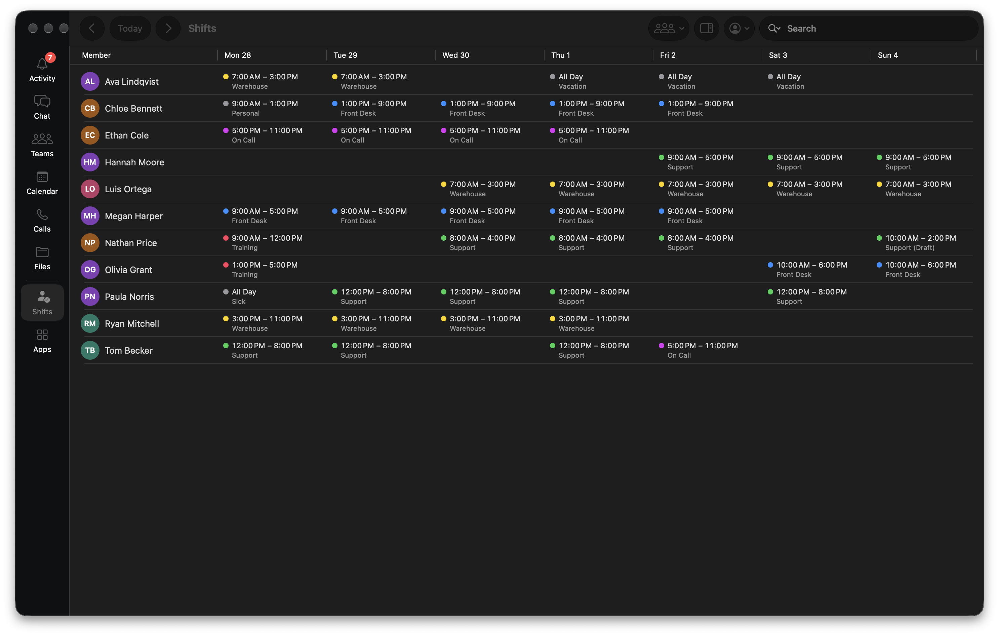
</details>

### Search

- Message search works offline from a local index on your Mac
- Online, server results merge in alongside it, with people and files
- Every hit opens at the exact message
- Find within a conversation, with next and previous match

### Catch Up (on-device AI)

- Summary, key points and action items for any conversation
- Choose the window: the last day, three days, five days or two weeks
- Mentions of you, <code>@everyone</code>, <code>@channel</code>, <code>@team</code> and your tags listed first
- Chatter that doesn't need you is filtered out, and you can mark more as Not Important
- Catch Up in the inspector beside the chat you're reading
- A dedicated Catch Up window that stays current in the background
- Click a mention in Catch Up to jump straight to the message
- Everything stays on your Mac; off by default

### Notifications

- Native banners with Reply, Mark as Read and Join actions
- Per-chat notification levels and keyword alerts
- Quiet hours, and silence while a Focus is on
- Unread count on the Dock icon, with New Chat and your status in the Dock menu
- Optional menu bar item

### Mac-native and keyboard

- Every toolbar command is also in the menu bar
- <kbd>⌘</kbd><kbd>1</kbd>–<kbd>6</kbd> for sections, <kbd>⌘</kbd><kbd>K</kbd> for Go To, next and previous unread
- Global quick composer hotkey (optional)
- Customize the sidebar: pin, reorder and remove sections and apps
- Larger or smaller text with <kbd>⌘</kbd><kbd>+</kbd> and <kbd>⌘</kbd><kbd>−</kbd>
- VoiceOver labels on icon-only controls
- Light and dark appearance, with updates that slot in quietly and no flashing lists

<details>
<summary>See the Settings window</summary>
<br>
<p align="center">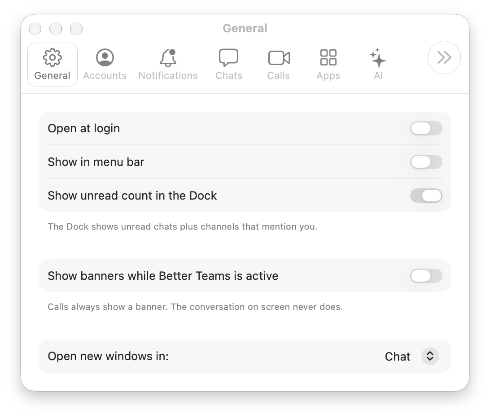</p>
</details>

### Accounts and privacy

- Sign in with a device code or in the browser
- Multiple accounts, switched in place
- Sign-in tokens live in the macOS keychain
- Export your chat archive, and rebuild the local search index

### For developers: MCP

`ostmac-mcp` is a Model Context Protocol server that gives AI assistants such as Claude Desktop access to your chats. It uses the app's session, so you only sign in once, in the app.

| Tool | What it does |
| --- | --- |
| `list-chats` | Recent one-to-one and group chats |
| `list-messages` | History for a chat or channel, with paging |
| `send-message` | Post a text message |
| `react-message` | Add or remove a reaction |
| `list-teams` / `list-channels` | Your teams and their channels |

Setup: [docs/mcp.md](docs/mcp.md).

<br>

## Get started

### Requirements

- macOS 26 or later
- Xcode command line tools (`swift`, `xcodebuild`) and Rust (`cargo`)
- Catch Up needs a Mac with Apple Intelligence turned on

### Build and run

```sh
./scripts/build-rust.sh   # Rust core (vendored ost + ostmac-core), release
./scripts/build-app.sh    # Better Teams.app in swift/.build/release
open "swift/.build/release/Better Teams.app"
```

**Try it without an account.** Demo mode runs fully offline with sample data:

```sh
open "swift/.build/release/Better Teams.app" --args --demo
```

### Install

```sh
./scripts/package.sh --install   # signed release build, copied to /Applications
./scripts/make-dmg.sh            # versioned installer disk image in tmp/
```

Signing uses `CODESIGN_IDENTITY` if set, otherwise your first Apple Development identity, otherwise ad-hoc. With ad-hoc signing, camera and microphone permissions don't survive a rebuild.

### Test

```sh
./scripts/test.sh   # Rust tests, then the Swift suites
```

## Under the hood

- **`swift/`**: the SwiftPM package. `OstMac` is the app entry point, `BetterTeamsUI` the AppKit and SwiftUI interface, `OstMacCore` the clients, stores and services, and `OstMacMCP` the MCP server.
- **`rust/ostmac-core/`**: a static library with a C ABI. JSON crosses the boundary, which keeps it version-tolerant.
- **`rust/ost/`**: the vendored [ost](https://github.com/eisbaw/ost) Teams protocol core, with every local change documented in `rust/ost/OSTMAC-PATCHES.md`.

## Upstream and thanks

The Teams protocol core is [eisbaw/ost](https://github.com/eisbaw/ost), the Open Source Teams client in Rust. Thank you. It is vendored under `rust/ost` so it builds on macOS as a library.

## Contributing

PRs are welcome. Run `./scripts/test.sh` first, and keep screenshots to demo mode (`--demo`): no real chats, names or tokens in commits.

<sub>Better Teams is an independent project. It is not affiliated with, endorsed by, or sponsored by Microsoft. Microsoft, Microsoft Teams, OneDrive, SharePoint, OneNote, Planner and To Do are trademarks of the Microsoft group of companies. Apple, Mac, macOS and Apple Intelligence are trademarks of Apple Inc.</sub>

## License

Better Teams is free for everyone to use, modify, redistribute and sell —
personally or commercially — under an MIT-style license, with one exception:
Microsoft (including its affiliates and anyone acting on its behalf) receives
no rights under it and needs a commercial license from the author. See
[LICENSE](LICENSE) for the full terms.

Third-party components, including the vendored `rust/ost` and the Rust crates
it depends on, keep their own licenses; see [NOTICE](NOTICE).

For commercial licensing, contact [@mrowlinson](https://github.com/mrowlinson)
on GitHub by opening an issue.
